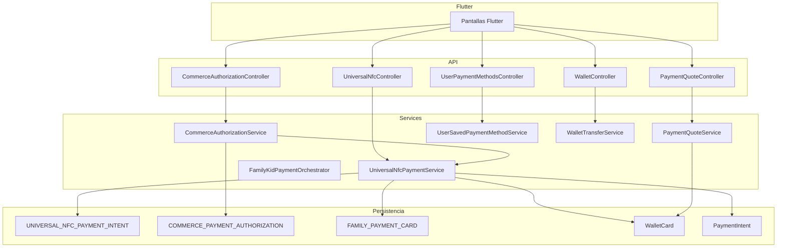
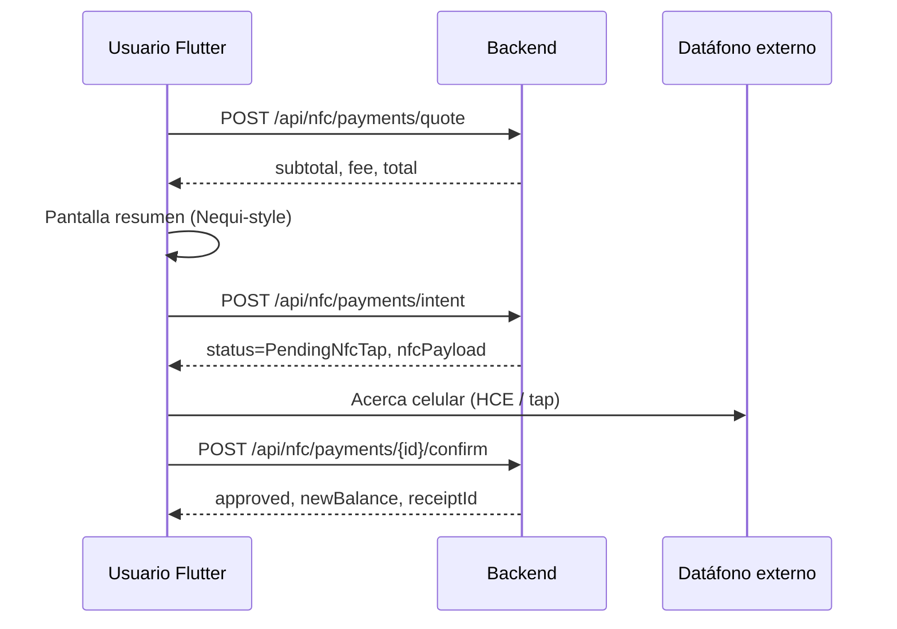
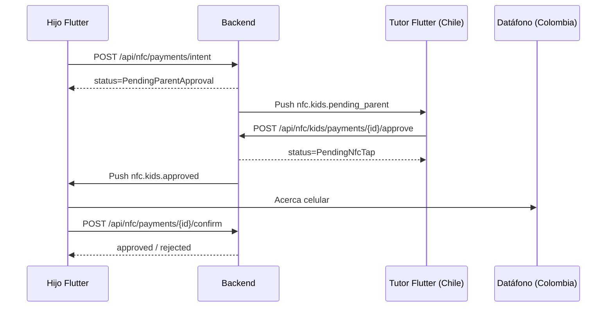
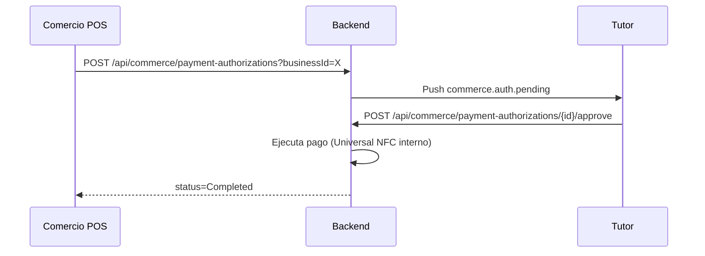

# Contrato técnico Flutter — Pagos, NFC Universal, Kids y Mercado Pago

**Versión:** 2026-07-05  
**Backend:** Ciervo-backend (.NET 8)  
**Audiencia:** Equipo Flutter mobile

---

## 1. Resumen ejecutivo

Este documento consolida la **auditoría real del código** y el **contrato de API** para implementar en Flutter:

- Cotización Nequi-style (comisión 1% solo en confirmación)
- NFC Universal (comercios no registrados en Ciervo)
- Kids + aprobación remota del tutor
- Autorización por comercio (sin depender del dispositivo del hijo)
- Métodos de pago múltiples (Wallet, Mercado Pago, Visa, Mastercard)
- Corrección del flujo de tarjetas Kids

**Regla de oro:** Flutter **nunca** calcula comisiones, totales ni descuenta saldo localmente. Todo viene del backend.

---

## 2. Auditoría por módulo

| Módulo | Estado | Evidencia |
|--------|--------|-----------|
| Family Payments | **EXISTE** | `FamilyPaymentController`, `FamilyKidPaymentOrchestrator`, migración `20260701193000` |
| Kids Wallet | **EXISTE** | `KidsFinancialService`, `ChildWalletCard` |
| Kids Card (virtual) | **EXISTE** | `POST /api/guardians/children/{id}/wallet/cards` |
| Kids Card (Visa/MC propia) | **NO EXISTE** (diseño) | Solo tutor tokeniza en `FamilyPaymentCard` |
| Mercado Pago | **EXISTE** | `MercadoPagoPaymentProvider`, QR dual wallet/MP |
| NFC adulto (comercio Ciervo) | **EXISTE** | `CiervoNfcService`, `/api/wallet/nfc/*` |
| NFC Universal | **NUEVO** | `UniversalNfcPaymentService`, `/api/nfc/payments/*` |
| NFC Kids + tutor remoto | **NUEVO** | `UniversalNfcParentApproval`, `/api/nfc/kids/payments/*` |
| Payment Intents | **EXISTE** | `PaymentIntent` entity |
| Parent Approval | **EXISTE** (3 sistemas) | Family, Kids QR, GuardianPaymentAuthorization |
| Child Approval | **NO EXISTE** | Solo tutor aprueba |
| Commerce Authorization | **NUEVO** | `CommercePaymentAuthorization` |
| QR Payments | **EXISTE** | `PaymentQrService` |
| Payment Requests | **EXISTE** | `PaymentRequestService` |
| Wallet Holds | **EXISTE** | `WalletHoldService` |
| Tokenización Visa/MC | **PARCIAL** | Tutor: `FamilyPaymentCard`; adulto NFC: nuevo flujo |
| Wallet | **EXISTE** | `WalletService` |
| Merchant/Commerce | **EXISTE** | `BusinessPaymentsController`, PIN, QR |
| Comisión 1% global | **NUEVO** | `PaymentQuoteService` (antes solo delivery productos) |
| Cloud Tasks | **NO EXISTE** | Expiración inline |
| Firebase Auth | **EXISTE** | `AuthService` |
| FCM Push | **EXISTE** | `PushNotificationsCiervoMvp` |
| Background Jobs | **PARCIAL** | `ScheduledNotificationWorker`; sin worker de aprobaciones programadas |

### 2.1 Causa real: "no deja agregar tarjeta a Kids"

**No es un bug de validación.** Es diseño de dominio:

1. `ChildWalletCard` es **tarjeta virtual prepago** (saldo interno). No tiene `CardToken`, `Brand`, `Last4`.
2. Visa/Mastercard tokenizadas viven en `FamilyPaymentCard` del **tutor** (`ClientOnly`).
3. Flutter probablemente llamaba `/api/family/payment-methods/cards` esperando asociarla al menor directamente.

**Flujo correcto (corregido y documentado):**

```
Tutor → POST /api/family/payment-methods/cards        (tokeniza Visa/MC)
Tutor → POST /api/guardians/children/{id}/payment-sources  (vincula al menor)
Menor → paga con Kids Wallet o fallback a tarjeta tutor
```

**Fix aplicado:**
- `Currency` opcional al crear tarjeta Kids (default = moneda del tutor)
- `GET /api/guardians/children/{id}/payment-methods` — estado completo + hint
- `POST /api/guardians/children/{id}/payment-sources` — alias claro para vincular tarjeta tutor

### 2.2 Mercado Pago — ¿de dónde sale el dinero?

| Flujo | Origen real |
|-------|-------------|
| Recarga wallet adulto | MP checkout → acredita `WalletCard` |
| QR comercio `paymentMethod=wallet` | Debita `WalletCard` |
| QR comercio `paymentMethod=mercadopago` | **MP directo, NO wallet** |
| Kids Wallet pago | Saldo `ChildWalletCard` |
| Kids fallback ParentCard | **MP cobro tarjeta tutor tokenizada** |
| NFC Universal `mercadopago` | **MP directo, NO wallet** |
| NFC Universal `wallet` | Debita `WalletCard` (total incluye fee) |
| NFC Universal `visa/mastercard` | Cobro tarjeta tokenizada tutor/adulto |

---

## 3. Arquitectura



---

## 4. Comisión 1% — estilo Nequi

### Comportamiento

- La comisión **NO** se muestra en pantallas de ingreso de monto
- Solo aparece en **pantalla de resumen/confirmación** vía quote
- Flutter muestra: subtotal, fee, tax, discount, cashback, total, currency

### Endpoints

| Método | Ruta | Uso |
|--------|------|-----|
| POST | `/api/payment/quote` | Quote genérico (transfer, QR, etc.) |
| POST | `/api/nfc/payments/quote` | Quote NFC |
| POST | `/api/wallet/transfer/quote` | Quote transferencia P2P |

### Request — `POST /api/payment/quote`

```json
{
  "type": "wallet_transfer",
  "amount": 100000,
  "currency": "COP",
  "origin": "wallet",
  "destination": "ciervo-user-123",
  "paymentMethodId": "wallet"
}
```

### Response

```json
{
  "status": true,
  "value": {
    "subtotal": 100000,
    "fee": 1000,
    "tax": 0,
    "discount": 0,
    "cashback": 0,
    "total": 101000,
    "currency": "COP",
    "type": "wallet_transfer",
    "paymentMethod": "Wallet",
    "feePercentage": 1.00,
    "feeApplies": true,
    "availableBalance": 150000,
    "sufficientFunds": true
  }
}
```

**Tipos con comisión:** `wallet_transfer`, `nfc_universal`, `qr_payment`, `kids_payment`, `commerce_authorization`  
**Sin comisión en quote:** `mercadopago`, `visa`, `mastercard` (cobro externo)

### Transferencia P2P

`POST /api/wallet/transfer` ahora debita **total** (subtotal + fee). El receptor recibe solo **subtotal**.

---

## 5. NFC Universal — Flujos

### 5.1 Adulto — comercio no registrado



### 5.2 Kids — tutor en otro país



### 5.3 Autorización por comercio (hijo sin conexión estable)



El comercio **no depende** del dispositivo del hijo. El tutor responde desde cualquier lugar.

---

## 6. Endpoints completos

### 6.1 Quote y pagos generales

| Método | Ruta | Auth | Descripción |
|--------|------|------|-------------|
| POST | `/api/payment/quote` | Client | Cotización universal |
| POST | `/api/wallet/transfer/quote` | Client | Cotización transferencia |
| POST | `/api/wallet/transfer` | Client | Ejecuta transferencia (usa total del quote) |

### 6.2 NFC Universal

| Método | Ruta | Auth | Descripción |
|--------|------|------|-------------|
| POST | `/api/nfc/payments/quote` | Client/Kid | Cotización NFC |
| POST | `/api/nfc/payments/intent` | Client/Kid | Crear intención |
| GET | `/api/nfc/payments/{paymentIntentId}` | Client/Kid | Consultar estado |
| POST | `/api/nfc/payments/{paymentIntentId}/confirm` | Client/Kid | Confirmar tras tap |
| POST | `/api/nfc/payments/{paymentIntentId}/cancel` | Client/Kid | Cancelar |

### 6.3 NFC Kids — aprobación tutor

| Método | Ruta | Auth | Descripción |
|--------|------|------|-------------|
| GET | `/api/nfc/kids/payments/approvals` | Client (tutor) | Bandeja pendientes |
| POST | `/api/nfc/kids/payments/{paymentIntentId}/approve` | Client (tutor) | Autorizar |
| POST | `/api/nfc/kids/payments/{paymentIntentId}/reject` | Client (tutor) | Rechazar |

### 6.4 Autorización comercio

| Método | Ruta | Auth | Descripción |
|--------|------|------|-------------|
| POST | `/api/commerce/payment-authorizations?businessId={id}` | Business | Iniciar solicitud |
| GET | `/api/commerce/payment-authorizations/{authorizationId}` | Client/Business | Consultar |
| POST | `/api/commerce/payment-authorizations/{authorizationId}/approve` | Client (tutor) | Aprobar y cobrar |
| POST | `/api/commerce/payment-authorizations/{authorizationId}/reject` | Client (tutor) | Rechazar |

### 6.5 Métodos de pago (tarjetas de respaldo)

| Método | Ruta | Auth | Descripción |
|--------|------|------|-------------|
| GET | `/api/payment-methods` | Client | Listar todos |
| POST | `/api/payment-methods` | Client | Registrar (wallet/mp/visa/mc) |
| POST | `/api/payment-methods/default` | Client | Marcar predeterminado |
| DELETE | `/api/payment-methods/{methodId}` | Client | Eliminar |

### 6.6 Kids — tarjetas y fuentes

| Método | Ruta | Auth | Descripción |
|--------|------|------|-------------|
| GET | `/api/guardians/children/{childId}/payment-methods` | Client | Estado + hint |
| POST | `/api/guardians/children/{childId}/wallet/cards` | Client | Crear tarjeta virtual Kids |
| POST | `/api/guardians/children/{childId}/payment-sources` | Client | Vincular tarjeta tutor |
| POST | `/api/family/payment-methods/cards` | Client | Tokenizar Visa/MC tutor |

### 6.7 Endpoints legacy (NO romper)

| Módulo | Rutas clave |
|--------|-------------|
| Wallet NFC comercio Ciervo | `/api/wallet/nfc/sessions`, `/charge` |
| Kids NFC comercio | `/api/businesses/{id}/kids-nfc/pay` |
| QR | `/api/payments/qr/{token}/pay` |
| Family payments | `/api/kids/payment/request` |
| Kids QR supervisado | `/api/kids/payments/scan` |

---

## 7. DTOs

### PaymentQuoteRequest

| Campo | Tipo | Requerido | Validación |
|-------|------|-----------|------------|
| type | string | sí | `wallet_transfer`, `nfc_universal`, `qr_payment`, etc. |
| amount | decimal | sí | > 0 |
| currency | string | sí | ISO, ej. COP |
| origin | string | no | wallet, card id |
| destination | string | no | user code, merchant |
| paymentMethodId | string | no | `wallet`, `mercadopago`, `visa`, `mastercard`, card id |
| context | string | no | UniversalNfc |
| country | string | no | CO |
| childProfileId | int | no | Para Kids |

### PaymentQuoteResponse

| Campo | Tipo | Descripción |
|-------|------|-------------|
| subtotal | decimal | Monto base |
| fee | decimal | Comisión 1% si aplica |
| tax | decimal | Impuestos (0 por ahora) |
| discount | decimal | Descuentos |
| cashback | decimal | Cashback estimado |
| total | decimal | **Monto a cobrar** |
| currency | string | Moneda |
| feePercentage | decimal? | 1.00 si aplica |
| feeApplies | bool | Si hay comisión |
| availableBalance | decimal? | Saldo disponible wallet |
| sufficientFunds | bool | Si alcanza para total |

### NfcPaymentIntentRequest

| Campo | Tipo | Requerido |
|-------|------|-----------|
| idempotencyKey | string | sí |
| amount | decimal | sí |
| currency | string | sí |
| paymentMethodId | string | no (default wallet) |
| context | string | no (UniversalNfc) |
| merchantId | int? | no |
| merchantName | string | no |
| merchantReference | string | no |
| country | string | no |
| requiresParentApproval | bool? | auto true para Kids |
| childProfileId | int? | para tutor pagando por hijo |

### NfcPaymentConfirmResponse

| Campo | Tipo |
|-------|------|
| approved | bool |
| status | string (enum) |
| reason | string (PaymentRejectReason) |
| message | string |
| transactionId | string |
| receiptId | string |
| subtotal, fee, total | decimal |
| currency | string |
| newBalance | decimal? |
| receipt | PaymentReceiptResponse |

### SavedPaymentMethodResponse

| Campo | Tipo |
|-------|------|
| id | string |
| type | wallet / mercadopago / visa / mastercard |
| brand | string |
| last4 | string? |
| displayName | string? |
| expiryMonth, expiryYear | int? |
| status | active / inactive |
| isDefault | bool |
| isTokenized | bool |

---

## 8. Enums

### NfcPaymentStatus

| Valor | Significado | UI Flutter |
|-------|-------------|------------|
| Draft | Borrador | No mostrar |
| Quoted | Cotizado | Resumen |
| PendingNfcTap | Esperando tap NFC | "Acerca tu celular" |
| PendingParentApproval | Esperando tutor | Loading + push listener |
| Approved | Aprobado | Éxito + recibo |
| Rejected | Rechazado | Error con reason |
| Cancelled | Cancelado | Volver atrás |
| Expired | Expirado | Ofrecer reintentar |
| Failed | Fallido | Error genérico |
| Refunded | Reembolsado | Historial |

### PaymentRejectReason

| Valor | Mensaje sugerido UI |
|-------|---------------------|
| InsufficientFunds | Saldo insuficiente. Recarga tu wallet. |
| PaymentMethodInvalid | Método de pago no válido. |
| MercadoPagoRejected | Mercado Pago rechazó el pago. |
| CardRejected | Tu tarjeta fue rechazada. |
| ParentRejected | El tutor rechazó el pago. |
| LimitExceeded | Superaste el límite permitido. |
| KidsRuleBlocked | Bloqueado por reglas parentales. |
| NfcNotAvailable | NFC no disponible en tu plan. |
| Expired | El pago expiró. Intenta de nuevo. |
| Unknown | Error inesperado. |

### CommerceAuthorizationStatus

`Pending`, `Approved`, `Rejected`, `Expired`, `Completed`, `Failed`, `Cancelled`

### SavedPaymentMethodType

`Wallet=1`, `MercadoPago=2`, `Visa=3`, `Mastercard=4`

---

## 9. Eventos Push (FCM)

| Evento | Quién recibe | Acción Flutter |
|--------|--------------|----------------|
| `nfc.kids.pending_parent` | Tutor | Abrir bandeja aprobaciones NFC |
| `nfc.kids.approved` | Hijo | Continuar flujo tap NFC |
| `nfc.kids.rejected` | Hijo | Mostrar rechazo |
| `nfc.kids.payment.succeeded` | Tutor | Toast + refrescar historial |
| `nfc.payment.succeeded` | Adulto | Refrescar saldo + recibo |
| `commerce.auth.pending` | Tutor | Abrir autorización comercio |
| `commerce.auth.completed` | Comercio | Actualizar POS |
| `commerce.auth.rejected` | Comercio | Mostrar rechazo |
| `payment.pending_parent` | Tutor | Family payments (legacy) |
| `KIDS_PAYMENT_REQUEST` | Tutor | Kids QR (legacy) |

Payload típico en `metadataJson`:

```json
{
  "type": "nfc.kids.pending_parent",
  "paymentIntentId": "NFC-abc123",
  "approvalId": "NFCAPR-xyz",
  "kidId": 42,
  "amount": 28000,
  "currency": "COP",
  "merchantName": "McDonalds"
}
```

---

## 10. Orden recomendado para Flutter

### Pantalla "Pagar con NFC"

1. `GET /api/payment-methods` — cargar selector
2. Usuario ingresa monto manualmente
3. `POST /api/nfc/payments/quote` — obtener resumen
4. Pantalla resumen (subtotal, fee, total) — **estilo Nequi**
5. `POST /api/nfc/payments/intent`
6. Si `PendingParentApproval` → esperar push / polling `GET /api/nfc/payments/{id}`
7. Si `PendingNfcTap` → pantalla "Acerca tu celular al datáfono"
8. Tras tap → `POST /api/nfc/payments/{id}/confirm`
9. Si `approved` → `GET /api/receipts` o usar `receipt` en response
10. Refrescar `GET /api/wallet/cards/{id}/balance`

### Pantalla transferencia

1. Usuario ingresa monto
2. `POST /api/wallet/transfer/quote`
3. Resumen con comisión
4. `POST /api/wallet/transfer` con mismo amount (backend calcula total)

### Configuración Kids tarjeta tutor

1. `GET /api/guardians/children/{id}/payment-methods`
2. Si no hay `parentBackupCards` → guiar a tokenizar tarjeta tutor
3. `POST /api/family/payment-methods/cards` (MP SDK tokeniza en cliente)
4. `POST /api/guardians/children/{id}/payment-sources`

---

## 11. NFC Universal — Viabilidad técnica y contrato Flutter

### Qué sí quedó implementado (backend)

- Cotización con comisión antes de confirmar
- Intención de pago con hold de saldo (wallet)
- Confirmación transaccional post-tap
- Cobro por Wallet, Mercado Pago o tarjeta tokenizada
- Aprobación remota del tutor para Kids
- Autorización iniciada por comercio sin dispositivo del hijo
- Registro de movimiento + recibo

### ¿Se puede leer el monto del datáfono automáticamente?

**Auditoría técnica — conclusión: NO viable en MVP general.**

| Tecnología | Limitación |
|------------|------------|
| **Android HCE** | El teléfono **emula tarjeta**. No lee montos del terminal. El datáfono fija el monto. |
| **Android NFC Reader Mode** | Lee tags NDEF/ISO-DEP, **no** extrae monto de transacciones EMV contactless del datáfono del comercio. |
| **iOS Core NFC** | Solo lectura NDEF en apps en foreground. **No HCE** (no puede emular tarjeta para pagar en datáfono tradicional). |
| **EMV Contactless** | Monto lo define el **terminal adquirente**, no el teléfono del pagador. |
| **Datáfonos comunes** | Redes Visa/MC/MP; no exponen monto al dispositivo del cliente en tap-to-pay consumer-to-acquirer. |
| **PCI** | Leer PAN/monto del terminal violaría modelo de seguridad EMV tokenizado. |

### Flujo MVP recomendado (obligatorio)

1. Usuario abre "Pagar con NFC"
2. **Ingresa monto manualmente** en Ciervo
3. Ve resumen con comisión (quote)
4. Confirma y acerca al datáfono
5. Backend valida y ejecuta

### Flujo futuro ideal (investigación)

- Integración directa con redes de pago / wallets certificadas (Apple Pay, Google Pay, MP Tap)
- Partnership con adquirente que soporte push provisioning
- QR dinámico en datáfono que Ciervo escanee (alternativa a NFC)

### Dependencias por capa

| Capa | Depende de |
|------|------------|
| OS | Android HCE para emulación; iOS limitado a Apple Pay externo |
| Hardware | Chip NFC en dispositivo |
| Proveedor pagos | MP/Visa/MC APIs para cobro tokenizado |
| Backend Ciervo | Quote + intent + confirm (implementado) |

---

## 12. Casos de error — qué hacer en Flutter

| Escenario | Endpoint | UI |
|-----------|----------|-----|
| Sin saldo | quote.sufficientFunds=false | Botón recargar wallet |
| MP rechaza | confirm.reason=MercadoPagoRejected | Reintentar u otro método |
| Tarjeta rechazada | confirm.reason=CardRejected | Elegir otro método |
| Tutor rechaza | push nfc.kids.rejected | Mensaje al hijo |
| Expiró | confirm.reason=Expired | Reiniciar flujo |
| NFC no disponible | intent error | Upsell membresía |

---

## 13. Migración base de datos

**Archivo:** `DataAccess/Migrations/20260705190000_UniversalNfcPaymentsMvp.cs`

**Tablas nuevas:**
- `UNIVERSAL_NFC_PAYMENT_INTENT`
- `UNIVERSAL_NFC_PARENT_APPROVAL`
- `COMMERCE_PAYMENT_AUTHORIZATION`
- `USER_PAYMENT_METHOD_PREFERENCE`

Ejecutar: `dotnet ef database update` o script SQL en Cloud SQL.

---

## 14. Checklist QA

### Quote / Comisión
- [ ] Transferencia $100.000 → quote total $101.000
- [ ] Transfer ejecutada debita $101.000, receptor recibe $100.000
- [ ] Quote MP no incluye fee
- [ ] Pantalla ingreso NO muestra comisión (solo resumen)

### NFC Universal adulto
- [ ] Quote → intent → confirm con wallet suficiente
- [ ] Rechazo saldo insuficiente
- [ ] Cancel libera hold
- [ ] Expiración a los 5 min
- [ ] Recibo generado
- [ ] newBalance correcto

### NFC Kids
- [ ] Intent crea PendingParentApproval
- [ ] Push al tutor (metadata correcta)
- [ ] Approve remoto (tutor en otro país)
- [ ] Reject cancela operación
- [ ] Confirm tras approve ejecuta pago

### Mercado Pago NFC
- [ ] Selección MP no debita wallet
- [ ] Rechazo MP propaga a Flutter

### Tarjetas respaldo
- [ ] Listar wallet + visa + mc + mp
- [ ] Set default
- [ ] Tokenización sin PAN en backend

### Kids tarjetas
- [ ] Crear tarjeta virtual sin currency (default tutor)
- [ ] GET payment-methods muestra hint
- [ ] Vincular tarjeta tutor vía payment-sources

### Compatibilidad
- [ ] QR wallet sigue funcionando
- [ ] QR mercadopago sigue funcionando
- [ ] Wallet NFC comercio Ciervo sin cambios
- [ ] Kids QR supervisado sin cambios
- [ ] Family payments sin cambios
- [ ] Cashback / puntos / historial intactos

### Autorización comercio
- [ ] Comercio inicia → tutor recibe push
- [ ] Approve ejecuta pago sin dispositivo hijo
- [ ] Comercio consulta estado Completed

---

## 15. Archivos modificados / creados

### Nuevos
- `Models/Enums/PaymentQuoteEnums.cs`
- `DataAccess/Models/UniversalNfcEntities.cs`
- `DataAccess/Models/CiervodbContext.UniversalNfc.cs`
- `DataAccess/Migrations/20260705190000_UniversalNfcPaymentsMvp.cs`
- `DTO/PaymentQuoteDtos.cs`
- `Business/Services/PaymentQuoteService.cs`
- `Business/Services/UniversalNfcPaymentService.cs`
- `Business/Services/CommerceAuthorizationService.cs`
- `Business/Services/UserSavedPaymentMethodService.cs`
- `Business/Services/KidsPaymentMethodSetupService.cs`
- `Business/Services/Contracts/IPaymentQuoteService.cs`
- `WebApi/Controllers/PaymentQuoteController.cs`
- `Business.Tests/PaymentQuoteServiceTests.cs`
- `docs/FLUTTER-PAYMENTS-NFC-CONTRACT.md`

### Modificados
- `DataAccess/Models/CiervodbContext.KidsQr.cs`
- `DTO/GuardiansDtos.cs`
- `Business/Services/KidsFinancialService.cs`
- `Business/Services/WalletTransferService.cs`
- `WebApi/Controllers/WalletController.cs`
- `WebApi/Controllers/GuardiansController.cs`
- `IOC/Dependencies.cs`

---

## 16. Swagger

Tras deploy, los endpoints aparecen automáticamente en `/swagger` bajo tags:
- `PaymentQuoteController`
- `UniversalNfcController`
- `CommerceAuthorizationController`
- `UserPaymentMethodsController`

---

## 17. Contacto y referencias internas

- `docs/AUDIT-PAYMENTS-BACKEND.md` — auditoría previa
- `docs/FAMILY-PAYMENT-API-CONTRACT.md` — Family payments
- `docs/PAYMENTS-API-CONTRACT.md` — MP + wallet
- `docs/QR-NFC-PAYMENTS-CONTRACT.md` — NFC comercio Ciervo (legacy)
