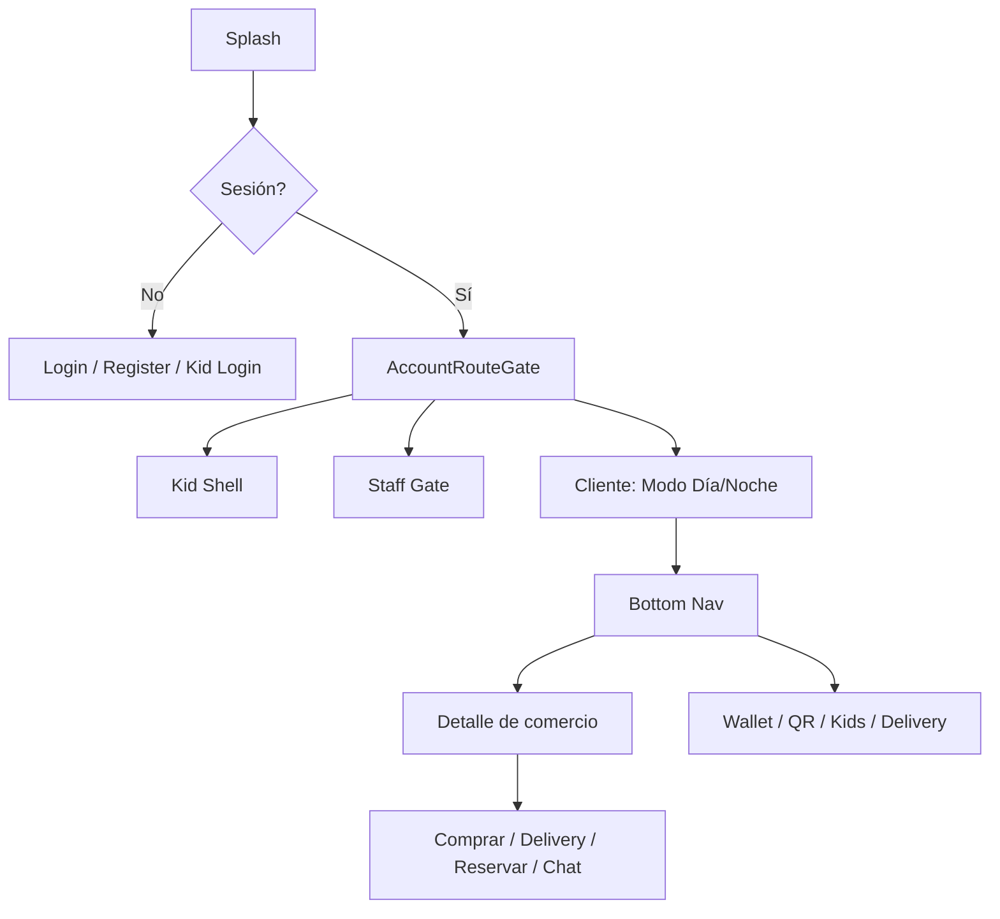

# Ciervo Club — Funcionalidades de la App Móvil

Documentación de todas las funcionalidades disponibles en la aplicación Flutter de Ciervo Club.

---

## Visión general

**Ciervo Club** es una super-app de lifestyle y comercio con wallet digital, descubrimiento de negocios, reservas, delivery, chat, pagos familiares (Kids), NFC, membresías y múltiples flujos de pago.

La arquitectura sigue el patrón **feature-first** bajo `lib/features/` con capas `data`, `domain` y `presentation`.

**Modos de experiencia:** Día / Noche — afecta el tema visual y el contenido de descubrimiento.

---

## Roles de usuario

| Rol | Destino tras login |
|-----|-------------------|
| **Cliente** (adulto) | Modo Día/Noche → navegación principal (5 tabs) |
| **Kid** (menor) | Shell dedicado (4 tabs) |
| **Staff** (personal de negocio) | Escáner QR y gestión de pedidos |
| **BusinessOwner** | Dashboard (placeholder) |
| **SuperAdmin** | Dashboard (placeholder) |
| **Domiciliario** | Acceso desde Perfil → "Trabajar como domiciliario" |

---

## Navegación principal

### Cliente adulto (5 tabs)

| Tab | Pantalla | Función |
|-----|----------|---------|
| Inicio | Home | Feed de descubrimiento, bonos, favoritos, campañas |
| Explorar | Search | Búsqueda de comercios, eventos y promociones |
| Chat | Chat Inbox | Bandeja de conversaciones y planes Vakupli |
| Reservas | Reservations | Reservas activas y nuevas |
| Perfil | Profile | Hub central de cuenta y accesos a módulos |

### Menor (4 tabs)

| Tab | Pantalla |
|-----|----------|
| Inicio | Kid Home (saldo, accesos rápidos) |
| Comercios | Comercios permitidos |
| Familia | Chat familiar |
| Yo | Perfil del menor |

### Personal de negocio

- Escanear QR de clientes
- Historial de escaneos
- Pedidos del negocio por estado

---

## Módulos y funcionalidades

### Autenticación (`auth`)

- Login y registro unificado por **correo electrónico**
- Lookup de cuenta existente
- Verificación de email
- Migración de cuentas legacy
- Registro con perfil y ubicación (división administrativa)
- Login de menores con usuario + PIN (`kid_auth`)

### Inicio y descubrimiento (`home`, `discovery`, `search`)

- Feed principal con ubicación y categorías
- Negocios cercanos y tarjetas de lugar
- Feed de actividad social/comercial
- Banners de campañas pagadas
- Sección de favoritos y bonos en home
- Búsqueda por texto y filtros de categoría
- Cambio de modo Día/Noche

### Detalle de comercio (`place_detail`)

- Galería, ubicación, horarios, promociones
- Catálogo de productos con filtros
- Comprar (checkout in-app)
- Pedir domicilio
- Reservar (fecha, hora, personas)
- Calificar y editar reseña
- Chat comercial con el negocio
- Agregar a favoritos
- Compartir negocio

### Favoritos (`favorites`)

- Lista de negocios favoritos con filtros
- Sección integrada en home

### Reservas (`reservations`)

- Mis reservas agrupadas
- QR de reserva
- Búsqueda por código
- Crear reserva desde detalle de lugar
- Solicitar dinero vinculado

### Delivery (`delivery`)

**Cliente:**
- Mis pedidos
- Detalle y seguimiento
- Checkout de pedido

**Domiciliario:**
- Solicitud para ser repartidor
- Toggle disponibilidad online/offline
- Pedidos disponibles (mapa)
- Mis entregas asignadas
- Detalle con PIN de entrega
- Chat con clientes
- Cuenta bancaria de liquidación
- Historial de liquidaciones

### Wallet (`wallet`)

- Dashboard premium de saldo y tarjetas
- Recargar saldo
- Recargar a otro usuario por CIERVO ID
- Transferencias P2P
- Solicitar dinero ("Paga por mí")
- Gestionar solicitudes de pago
- Aprobar/rechazar pagos pendientes
- Configurar pago NFC
- Tarjetas físicas NFC (registrar/bloquear)
- Sesión activa de pago NFC
- Envíos seguros de dinero

### NFC (`universal_nfc`, `kid_nfc`)

- Pago NFC universal (monto → método → resumen → sesión)
- Pago NFC para menores
- Aprobaciones parentales de pagos NFC Kids
- Registro de dispositivo/tarjeta NFC Kids

### Centro QR (`qr_hub`, `qr_wallet`)

- Mi QR / Escanear QR
- CIERVO ID como código QR
- Escáner con cámara
- Pago en comercio vía QR
- Acciones sobre usuario escaneado
- Enrutamiento inteligente según tipo de QR
- Wallet de activos: entradas, regalos, beneficios, cupones, puntos

### Ciervo Kids / Familia (`kids`, `family_payments`, `family_chat`)

**Gestión familiar (vista tutor):**
- Lista y gestión de menores
- Crear/editar perfil del menor
- Vincular hijo existente con código
- Wallet del menor (vista tutor)
- Pagar en comercio en nombre del hijo
- Límites de gasto
- Comercios y categorías permitidos
- Medios de pago del menor
- Aprobar solicitudes pay-for-me
- Asociar tarjeta NFC al hijo
- Vista previa "ver como ve su hijo"

**Reglas parentales:**
- Fuente de pago de respaldo
- Límites por compra/día/mes
- Comercios/categorías permitidos o bloqueados
- Horarios permitidos
- Pago automático con tarjeta del tutor
- Montos/categorías que requieren aprobación
- Geocerca para pagos seguros

**Pagos familiares:**
- Tarjetas del tutor (principal/respaldo)
- Historial de pagos familiares
- Aprobación de pagos pendientes
- Autenticación 3DS Mercado Pago

**Chat entre tutores** sobre un menor

### Experiencia del menor (`kid_shell`, `kid_me`, `kid_wallet`, `kid_businesses`, `kid_pay_for_me`, `kid_family_chat`)

- Dashboard con saldo y movimientos
- Comercios donde puede gastar
- Solicitudes pay-for-me al tutor
- Chat familiar
- Perfil, foto y apodo

### Chat y mensajería (`chat`, `chat_payments`, `users`)

- Bandeja unificada de conversaciones
- Chat 1:1 o grupal
- Envío de imágenes y ubicación
- Preview de último mensaje y contador de no leídos (estilo WhatsApp)
- Actualización en vivo al recibir notificaciones
- Pagos y regalos desde conversación
- Búsqueda de usuarios por CIERVO ID
- Acciones: chat, pagar, regalo, pay-for-me, recargar, reportar, bloquear

### Vakupli (`vakupli`)

- Planes compartidos / split de gastos
- Grupos de amigos
- Chat integrado por plan

### Perfil y cuenta (`profile`, `kyc`, `settings`)

- Foto de perfil y CIERVO ID
- Verificación de email
- Editar datos personales
- KYC: carga de documentos (frente/reverso/selfie)
- Configuración, ayuda, legal

### Membresías (`memberships`)

- Planes y suscripción
- Beneficios por plan
- Facturas
- Límites por plan (Kids, chat privado, etc.)
- Promoción trial Gold

### Pagos e historial (`payments`, `financial_history`, `receipts`)

- Historial de transacciones
- Timeline financiero unificado
- Recibos y confirmación post-pago

### Bonos y recompensas (`bonuses`, `cashback`, `campaigns`, `promotions`)

- Catálogo de bonos
- Mis bonos reclamados
- Reclamar y redimir
- Cashback y puntos
- Banners de campañas pagadas
- Sheets promocionales

### PINs de comercio (`pins`)

- Crear y gestionar PINs Ciervo para pagos en negocio específico

### Envíos seguros (`secure_shipment`)

- Enviar y recibir dinero con PIN
- Validar PIN, cancelar, disputar, retener fondos

### Transporte (`transport`)

- Tarjetas de transporte público (módulo piloto)

### Notificaciones (`notifications`)

- Centro de notificaciones in-app
- Preferencias de notificación
- Badges en tabs
- Deep links a: chat, wallet, delivery, reservas, bonos, Vakupli, envíos seguros, NFC Kids, pay-for-me, QR hub, perfil

### Seguridad (`safety`, `legal`)

- Usuarios bloqueados
- Reportes
- Solicitud de datos (GDPR)
- Términos y política de privacidad

### Staff (`staff_scanner`, `staff_orders`)

- Escáner QR de clientes
- Gestión de pedidos del negocio (pending → delivered)

---

## Flujos transversales

**Métodos de pago:** wallet interno, NFC (universal y Kids), QR merchant, tarjetas familiares, Mercado Pago 3DS, transferencias P2P, pay-for-me, pagos en chat, envíos seguros.

**Control parental:** límites, horarios, geocerca, comercios/categorías, aprobaciones, pago automático, NFC parental.

---

## Accesos desde Perfil (hub central)

- KYC, Transporte, Wallet
- Métodos de pago familiar, historial familiar
- Solicitudes de pago, historial financiero, membresía
- Favoritos, Bonos, Beneficios (QR Wallet)
- Cashback, Cambiar Día/Noche, Mis pedidos
- Editar perfil, Reservas, QR Ciervo
- Trabajar como domiciliario
- Notificaciones, Configuración, Ayuda
- **Ciervo Kids / Familia**

---

## Módulos de soporte (sin pantalla propia)

| Módulo | Uso |
|--------|-----|
| `catalogs` | Países, bancos, asentamientos |
| `exchange` | Tipos de cambio |
| `loyalty` | Puntos en compras |
| `location` | Sincronización de ubicación |
| `media` | Imágenes autenticadas |
| `product_categories` | Filtros en catálogo |
| `onboarding` | Permisos iniciales (ubicación, notificaciones) |

---

*Última actualización: julio 2026*
