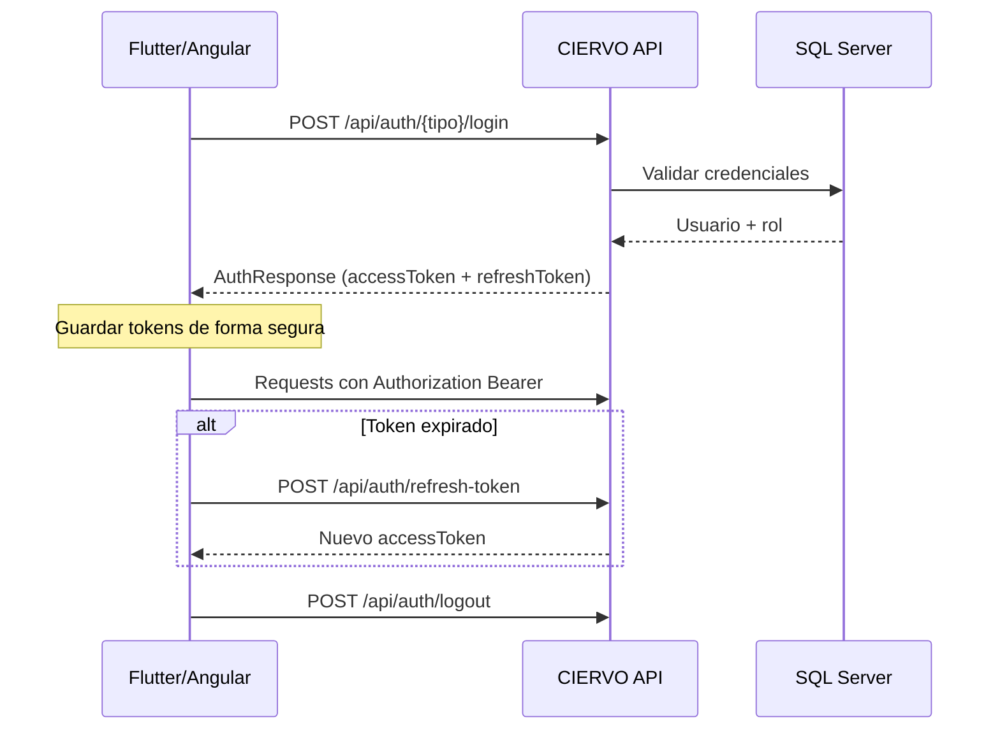
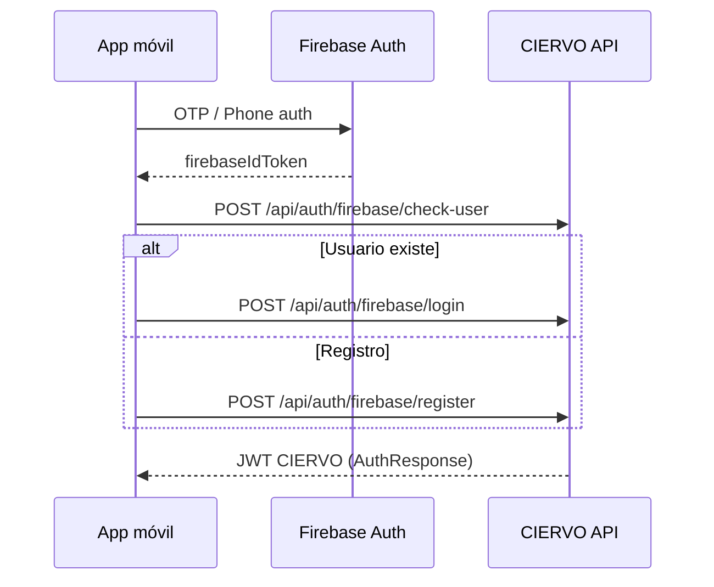
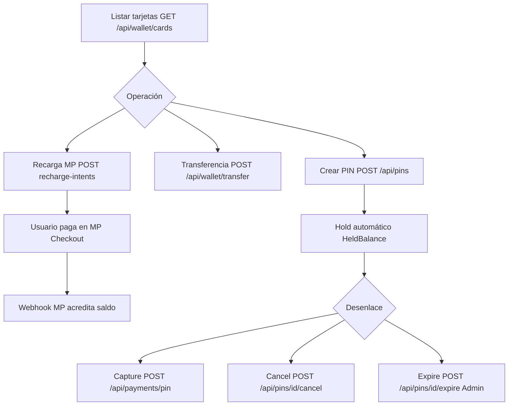
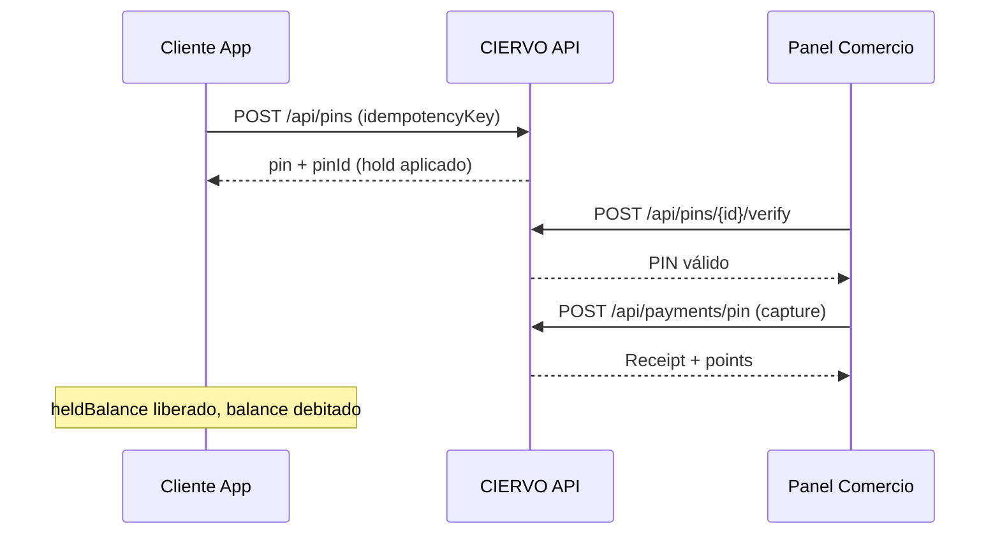
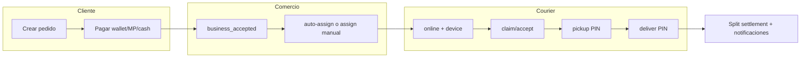
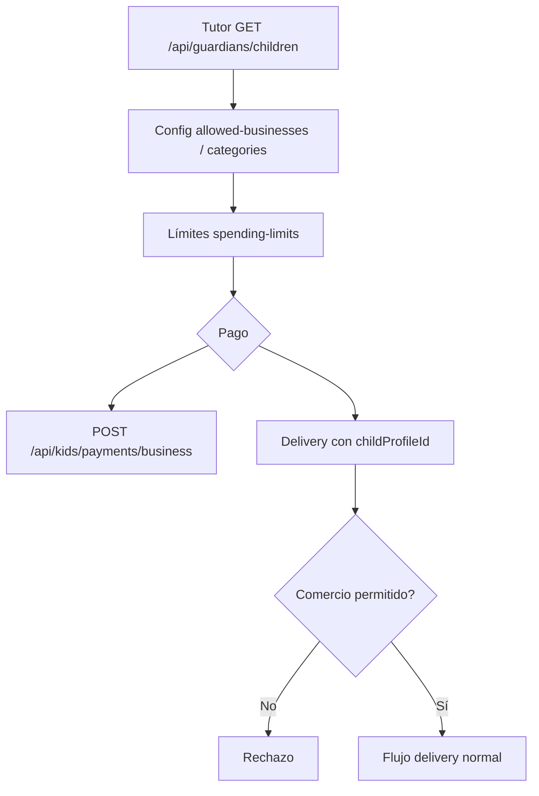
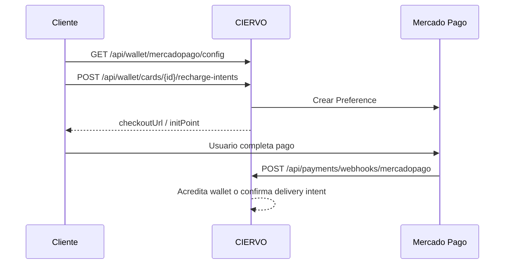

# CIERVO Backend — Documentación API MVP (Producción)

**Versión:** MVP estabilización · Jun 2026  
**Base URL producción:** `https://ciervo-backend-613568140358.southamerica-east1.run.app`  
**Revisión Cloud Run validada:** `ciervo-backend-00095-pt4`  
**Formato:** JSON · UTF-8 · camelCase en serialización

Este documento es la referencia oficial para equipos **Flutter** (cliente/domiciliario) y **Angular** (panel comercio/admin). No requiere leer el código del backend.

---

## 1. Convenciones globales

### 1.1 Envelope de respuesta

Casi todos los endpoints devuelven:

```json
{
  "status": true,
  "value": { },
  "msg": null
}
```

| Campo | Tipo | Descripción |
|-------|------|-------------|
| `status` | `bool?` | `true` = éxito de negocio; `false` = error controlado |
| `value` | `T?` | Payload tipado según endpoint |
| `msg` | `string?` | Mensaje de error o información |

**Regla para clientes:** tratar como error si `status === false` **o** HTTP ≥ 400, aunque el body traiga JSON.

### 1.2 Autenticación

Header obligatorio en endpoints protegidos:

```http
Authorization: Bearer {accessToken}
```

| Claim JWT | Valor | Uso |
|-----------|-------|-----|
| `role` | `"1"` | Cliente |
| `role` | `"2"` | Negocio (owner/staff vía `CLUB_USER`) |
| `role` | `"3"` | Admin plataforma |
| `accountKind` | `"BusinessUser"` | Login negocio |
| `accountKind` | `"PlatformAdmin"` | Login admin |

### 1.3 Políticas de autorización

| Política | Quién accede |
|----------|--------------|
| `ClientOnly` | Cliente (`role=1`) |
| `BusinessOnly` | Negocio (`role=2` o `accountKind=BusinessUser`) |
| `AdminOnly` | Admin (`role=3` o `accountKind=PlatformAdmin`) |
| `BusinessOrAdmin` | Negocio o Admin |
| `Authenticated` | Cualquier usuario con JWT válido |

### 1.4 Idempotencia

Operaciones financieras exigen `idempotencyKey` (string, max 100). Reutilizar la misma clave en reintentos; el backend deduplica.

### 1.5 Paginación

Query estándar: `page` (≥1), `pageSize` (1–100). Respuestas paginadas usan `PagedResponse<T>`: `{ page, pageSize, total, totalPages, items }`.

### 1.6 Códigos HTTP habituales

| Código | Cuándo |
|--------|--------|
| 200 | OK (revisar `status` en body) |
| 400 | Validación / regla de negocio |
| 401 | Sin token o token inválido |
| 403 | Rol insuficiente o ownership |
| 404 | Recurso no encontrado |
| 409 | Conflicto (ej. pedido ya tomado por otro courier) |
| 429 | Rate limit en auth |
| 500 | Error interno (`msg` genérico) |

---

## 2. Diagramas de flujo

### 2.1 Autenticación



**Flujo Firebase OTP (MVP):**



### 2.2 Wallet



**Balances:**

- `balance` = saldo total en tarjeta  
- `heldBalance` = fondos retenidos (PIN/holds)  
- `availableBalance` = `balance - heldBalance` (gasto disponible)

### 2.3 Payment PIN



### 2.4 Delivery



**Estados de pedido (strings API):**  
`pending_business_approval` → `business_accepted` / `pending_courier_acceptance` → `courier_assigned` → `accepted_by_courier` → `arrived_at_business` → `picked_up` → `on_the_way` → `arrived_at_customer` → `delivered`

### 2.5 Kids



### 2.6 Mercado Pago



---

## 3. Auth

### Índice de endpoints

| Método | Ruta | Auth | Descripción |
|--------|------|------|-------------|
| POST | `/api/auth/user/register` | Anónimo | Registro cliente |
| POST | `/api/auth/user/login` | Anónimo | Login cliente |
| POST | `/api/auth/login` | Anónimo | Login cliente (alias) |
| POST | `/api/auth/business/login` | Anónimo | Login negocio |
| POST | `/api/auth/admin/login` | Anónimo | Login admin |
| POST | `/api/auth/staff/login` | Anónimo | Login staff |
| POST | `/api/auth/refresh-token` | Anónimo | Renovar access token |
| POST | `/api/auth/logout` | Anónimo | Invalidar refresh |
| POST | `/api/auth/send-verification-code` | Anónimo | OTP email |
| POST | `/api/auth/verify-code` | Anónimo | Verificar OTP |
| POST | `/api/auth/recover-password` | Anónimo | Recuperar password |
| POST | `/api/auth/change-password` | Anónimo | Cambiar password |
| POST | `/api/auth/firebase/check-user` | Anónimo | Existe usuario Firebase |
| POST | `/api/auth/firebase/login` | Anónimo | Login Firebase |
| POST | `/api/auth/firebase/register` | Anónimo | Registro Firebase |

---

### POST `/api/auth/user/login`

| Campo | Valor |
|-------|-------|
| **Descripción** | Autentica cliente email/password y devuelve JWT |
| **Auth** | Ninguna (rate limit `AuthLogin`) |
| **Roles** | — |
| **DTO Request** | `LoginRequest` |
| **DTO Response** | `Response<AuthResponse>` |

**Request body:**

```json
{
  "user": "cliente@ejemplo.com",
  "password": "********"
}
```

> Alternativa: `"email"` en lugar de `"user"`.

**Response 200:**

```json
{
  "status": true,
  "value": {
    "userId": 10,
    "fullName": "Juan Pérez",
    "roleId": 1,
    "accountKind": "Client",
    "roleName": "Client",
    "accessToken": "eyJ...",
    "accessTokenExpiresAt": "2026-06-28T12:00:00Z",
    "refreshToken": "...",
    "refreshTokenExpiresAt": "2026-07-05T12:00:00Z",
    "permissions": []
  },
  "msg": null
}
```

**Validaciones:** `password` requerido; `user` o `email` obligatorio.  
**Errores:** 401 credenciales; 403 cuenta bloqueada/no verificada; 429 demasiados intentos.  
**Observaciones:** Usar `/api/auth/user/login` en apps nuevas. `/api/auth/login` es alias.

---

### POST `/api/auth/business/login`

Igual contrato que login cliente. `AuthResponse` incluye `businessId`, `businessRoleId`, `permissions[]` para staff.

---

### POST `/api/auth/admin/login`

Igual contrato. `roleId: 3`, `accountKind: "PlatformAdmin"`.

---

### POST `/api/auth/refresh-token`

**Request:** `{ "refreshToken": "..." }` (`RefreshTokenRequest`)  
**Response:** Nuevo `AuthResponse` con tokens rotados.

---

### POST `/api/auth/firebase/login`

**Request:** `FirebaseLoginRequest` — `{ "firebaseIdToken": "...", "phone": "+57..." }`  
**Response:** `AuthResponse` si el usuario ya existe y teléfono verificado.

---

## 4. Usuarios y Comercios (resumen MVP)

Endpoints de perfil cliente/comercio existentes fuera del núcleo financiero MVP. Los consumidores móviles usan principalmente auth + wallet; Angular comercio usa además:

| Método | Ruta | Auth | Notas |
|--------|------|------|-------|
| GET | `/api/businesses/{id}` | Varía | Detalle público/comercio |
| GET | `/api/businesses/{id}/products` | BusinessOrAdmin | Catálogo |
| GET | `/api/clients/me` | ClientOnly | Perfil cliente |

*(Consultar controladores `ClientController`, `BusinessesController` para endpoints de perfil no críticos al MVP delivery/wallet.)*

---

## 5. Wallet

**Prefijo:** `/api/wallet` · **Política base:** `ClientOnly`

### 5.1 Cards

#### GET `/api/wallet/cards`

| Campo | Valor |
|-------|-------|
| **Descripción** | Lista tarjetas del usuario |
| **DTO Response** | `Response<List<WalletCardResponse>>` |

**Response ejemplo:**

```json
{
  "status": true,
  "value": [
    {
      "id": 7,
      "userId": 10,
      "balance": 500000.00,
      "heldBalance": 5000.00,
      "availableBalance": 495000.00,
      "currency": "COP",
      "isPrimary": true,
      "displayName": "CIERVO Principal",
      "statusId": 1
    }
  ]
}
```

#### GET `/api/wallet/cards/{cardId}`

Detalle de una tarjeta. Mismo DTO.

#### GET `/api/wallet/cards/{cardId}/balance`

**DTO Response:** `Response<WalletBalanceDetailResponse>`

---

### 5.2 Holds

#### GET `/api/wallet/holds`

**Ruta:** `/api/wallet/holds` (controlador `WalletHoldsController`)  
**DTO Response:** `Response<List<WalletHoldResponse>>`

| Campo hold | Descripción |
|------------|-------------|
| `status` | 1=Active, 2=Captured, 3=Cancelled, 4=Expired |
| `paymentPinId` | Vinculado si el hold es por PIN |

#### GET `/api/wallet/holds/{id}`

Detalle de un hold.

---

### 5.3 Movimientos

#### GET `/api/wallet/cards/{cardId}/transactions`

**Query:** `WalletTransactionQuery` — `page`, `pageSize`, `type`, `statusId`, `from`, `to`  
**DTO Response:** `Response<PagedResponse<WalletTransactionResponse>>`

---

### 5.4 Recargas Mercado Pago

#### GET `/api/wallet/mercadopago/config`

**DTO Response:** `Response<MercadoPagoWalletConfigResponse>`

```json
{
  "status": true,
  "value": {
    "enabled": true,
    "isSandbox": false,
    "publicKey": "APP_USR-...",
    "successUrl": "https://...",
    "failureUrl": "https://...",
    "pendingUrl": "https://..."
  }
}
```

#### POST `/api/wallet/cards/{cardId}/recharge-intents`

| Campo | Valor |
|-------|-------|
| **DTO Request** | `CreateWalletRechargeIntentRequest` |
| **DTO Response** | `Response<WalletRechargeIntentResponse>` |

**Request:**

```json
{
  "amount": 50000,
  "currency": "COP",
  "idempotencyKey": "recharge-uuid-001",
  "description": "Recarga CIERVO"
}
```

**Response:**

```json
{
  "status": true,
  "value": {
    "intent": { "id": 35, "status": 3, "amount": 50000 },
    "checkoutUrl": "https://www.mercadopago.com.co/checkout/...",
    "initPoint": "https://...",
    "preferenceId": "123456789-abcd"
  }
}
```

**Estados intent:** ver `PaymentStatus` (3=RequiresExternalAction hasta webhook).

#### GET `/api/wallet/recharge-intents/{intentId}`

Consulta estado post-pago.

---

### 5.5 Transferencias

#### POST `/api/wallet/transfer`

**DTO Request:** `WalletTransferRequest` — requiere `targetCiervoUserCode`, `amount`, `idempotencyKey`, `walletCardId` opcional.

#### POST `/api/wallet/recharge-by-ciervo-id`

Recarga P2P por código CIERVO.

#### GET `/api/wallet/resolve-user/{ciervoUserCode}`

Resuelve usuario destino antes de transferir.

---

### 5.6 Gestión tarjeta

| Método | Ruta | Body |
|--------|------|------|
| POST | `/api/wallet/cards/{id}/set-primary` | — |
| POST | `/api/wallet/cards/{id}/block` | `BlockWalletCardRequest` |
| POST | `/api/wallet/cards/{id}/unblock` | — |
| DELETE | `/api/wallet/cards/{id}` | — |

---

## 6. Mercado Pago

### POST `/api/payments/webhooks/mercadopago`

| Campo | Valor |
|-------|-------|
| **Auth** | `AllowAnonymous` |
| **Descripción** | Webhook MP; valida firma `x-signature` |
| **Body** | JSON raw de MP |
| **Headers** | `x-signature`, `x-request-id` |

**Respuestas:** 200 procesado; **400** firma inválida o payload no parseable.

**Reconciliación:**
- Referencia `wallet-recharge-*` → acredita tarjeta wallet.
- Referencia `delivery-order-*` → confirma pago pedido delivery.

---

## 7. Receipts y Auditoría financiera

### GET `/api/receipts`

**Auth:** ClientOnly · **Query:** `ReceiptQuery` (`page`, `pageSize`)  
**DTO Response:** `Response<PagedResponse<PaymentReceiptResponse>>`

### GET `/api/receipts/{id}`

Detalle comprobante.

### GET `/api/financial-history`

**Auth:** ClientOnly · **Query:** `FinancialHistoryQuery`  
**DTO Response:** `Response<PagedResponse<FinancialHistoryItemResponse>>`

Unifica movimientos wallet, pagos, recibos para auditoría cliente.

---

## 8. Payment PIN

### POST `/api/pins`

| Campo | Valor |
|-------|-------|
| **Auth** | ClientOnly |
| **DTO Request** | `CreateCiervoPinRequest` |
| **DTO Response** | `Response<CiervoPinResponse>` |

**Request:**

```json
{
  "walletCardId": 7,
  "businessId": 2,
  "amount": 25000,
  "currency": "COP",
  "expirationMinutes": 30,
  "allowedUses": 1,
  "idempotencyKey": "pin-uuid-001",
  "kidsMode": false,
  "requireParentApproval": false
}
```

**Response:**

```json
{
  "status": true,
  "value": {
    "id": 15,
    "pin": "482910",
    "amount": 25000,
    "status": 2,
    "statusName": "FundsHeld",
    "walletHoldId": 8,
    "expiresAt": "2026-06-28T11:30:00Z"
  }
}
```

**Estados PIN (`CiervoPinStatus`):** 1 Created, 2 FundsHeld, 3 WaitingPayment, 4 PaymentApproved, 5 Completed, 6 Cancelled, 7 Expired, 8 Rejected, 9 FraudDetected

**Errores:** límite diario por plan (`wallet.pin.daily` en membership); saldo insuficiente; tarjeta bloqueada.

---

### GET `/api/pins/{id}` · GET `/api/pins/me`

Consulta PIN(s) del cliente. En respuestas completadas el campo `pin` puede omitirse.

---

### POST `/api/pins/{id}/cancel`

**Auth:** ClientOnly · Libera hold y cancela PIN activo.

---

### POST `/api/pins/{id}/expire`

**Auth:** AdminOnly · Expira PIN y libera hold (operación admin/cron).

---

### POST `/api/pins/{id}/verify`

**Auth:** BusinessOrAdmin  
**Rutas:** `/api/pins/{id}/verify` o `/api/businesses/{businessId}/pins/{id}/verify`  
**DTO Request:** `VerifyPinRequest`

```json
{
  "businessId": 2,
  "pin": "482910",
  "amount": 25000
}
```

---

### POST `/api/payments/pin`

| Campo | Valor |
|-------|-------|
| **Auth** | BusinessOrAdmin |
| **DTO Request** | `PayWithPinRequest` |
| **DTO Response** | `Response<PinPaymentResponse>` |

**Request:**

```json
{
  "businessId": 2,
  "pin": "482910",
  "amount": 25000,
  "terminal": "POS-001",
  "idempotencyKey": "capture-uuid-001"
}
```

**Response incluye:** `pin`, `intent`, `receipt`, `pointsAwarded`.

**Errores:** PIN ya usado; expirado; monto no coincide; doble capture bloqueado por idempotency.

---

## 9. Delivery

### 9.1 Cliente — Pedidos

#### GET `/api/businesses/{businessId}/delivery-availability`

**Query:** `latitude`, `longitude`  
**DTO Response:** `Response<DeliveryAvailabilityResponse>`

#### POST `/api/businesses/{businessId}/delivery-orders`

| Campo | Valor |
|-------|-------|
| **Auth** | ClientOnly |
| **DTO Request** | `CreateClientDeliveryOrderRequest` |

**Request:**

```json
{
  "deliveryAddress": "Calle 123 #45-67",
  "latitude": 4.7165,
  "longitude": -74.212,
  "items": [{ "productId": 1, "quantity": 2 }],
  "notes": "Sin cebolla",
  "childProfileId": null
}
```

**Kids:** si `childProfileId` está presente, valida comercios/categorías permitidas.

**DTO Response:** `Response<DeliveryOrderResponse>`

---

### 9.2 Pagos delivery

#### POST `/api/delivery/orders/{orderId}/pay`

| Campo | Valor |
|-------|-------|
| **Auth** | ClientOnly |
| **DTO Request** | `DeliveryPayOrderRequest` |
| **DTO Response** | `Response<DeliveryPaymentResponse>` |

**Request:**

```json
{
  "paymentMethod": "wallet",
  "idempotencyKey": "pay-order-uuid",
  "walletCardId": 7
}
```

**Valores `paymentMethod`:** `wallet`, `mercadopago`/`mp`, `cash`/`efectivo`, `nfc` (preparado), `kidswallet`

**Respuestas por método:**

| Método | paymentStatus típico | Notas |
|--------|---------------------|-------|
| wallet | `Paid` | Débito inmediato |
| mercadopago | `Processing` | Devuelve `checkoutUrl` |
| cash | `CollectOnDelivery` | Cobro al entregar |

---

### 9.3 Comercio — Operación

| Método | Ruta | Auth | Descripción |
|--------|------|------|-------------|
| GET | `/api/businesses/{id}/delivery-orders` | BusinessOrAdmin | Listar pedidos |
| GET | `/api/businesses/{id}/delivery-orders/{orderId}` | BusinessOrAdmin | Detalle |
| PUT | `/api/businesses/{id}/delivery-orders/{orderId}/status` | BusinessOrAdmin | Cambiar estado |
| POST | `/api/businesses/{id}/delivery-orders/{orderId}/auto-assign` | BusinessOrAdmin | Asignación automática |
| POST | `/api/businesses/{id}/delivery-orders/{orderId}/assign-delivery` | BusinessOrAdmin | Asignación manual |
| GET | `/api/businesses/{id}/delivery-settlements` | BusinessOrAdmin | Liquidaciones |

**PUT status — Request:**

```json
{
  "status": "business_accepted",
  "notes": "Preparando pedido"
}
```

**Status comercio acepta (input):** `business_accepted`, `rejected_by_business`, `cancelled`, `preparing`, `ready_for_pickup`, etc.

---

### 9.4 Courier

| Método | Ruta | Descripción |
|--------|------|-------------|
| POST | `/api/delivery/apply` | Solicitar ser domiciliario |
| GET | `/api/delivery/me` | Perfil courier |
| POST | `/api/delivery/online` | `{ deviceId, imei }` |
| POST | `/api/delivery/offline` | Desconectar |
| POST | `/api/delivery/device/register` | Registrar dispositivo |
| PUT | `/api/delivery/location` | `{ latitude, longitude }` |
| GET | `/api/delivery/available-orders` | Pedidos disponibles |
| POST | `/api/delivery/orders/{id}/claim` | Tomar pedido |
| POST | `/api/delivery/orders/{id}/accept` | Aceptar asignación |
| POST | `/api/delivery/orders/{id}/pickup-confirm` | `{ pin }` 6 dígitos |
| POST | `/api/delivery/orders/{id}/deliver` | `{ pin }` entrega |
| GET | `/api/delivery/settlements` | Mis liquidaciones |

**Requisitos courier online:** perfil `Approved`, cuenta settlement verificada, device registrado.

---

### 9.5 Tips, Returns, Rating

| Método | Ruta | DTO Request |
|--------|------|-------------|
| POST | `/api/delivery/orders/{id}/tips` | `DeliveryTipRequest` |
| POST | `/api/delivery/orders/{id}/returns` | `CreateDeliveryReturnRequest` |
| POST | `/api/delivery/orders/{orderId}/rate` | `DeliveryRatingRequest` |

---

### 9.6 Tracking

| Método | Ruta |
|--------|------|
| GET | `/api/delivery/orders/{orderId}/tracking` |
| POST | `/api/delivery/orders/{orderId}/tracking` |

---

## 10. Kids

### 10.1 Tutores — Hijos

| Método | Ruta | DTO |
|--------|------|-----|
| POST | `/api/guardians/children` | `ChildProfileRequest` |
| GET | `/api/guardians/children` | — |
| GET | `/api/guardians/children/{childId}` | — |
| PUT | `/api/guardians/children/{childId}` | `ChildProfileRequest` |
| DELETE | `/api/guardians/children/{childId}` | — |

---

### 10.2 Wallet menor

| Método | Ruta |
|--------|------|
| GET | `/api/guardians/children/{childId}/wallet` |
| GET | `/api/guardians/children/{childId}/wallet/cards` |
| POST | `/api/guardians/children/{childId}/wallet/cards` |
| POST | `/api/guardians/children/{childId}/wallet/cards/{cardId}/recharge` |
| GET | `/api/guardians/children/{childId}/wallet/history` |

---

### 10.3 Límites y permisos

| Método | Ruta | DTO |
|--------|------|-----|
| GET/PUT | `/api/guardians/children/{id}/spending-limits` | `ChildSpendingLimitRequest` |
| GET/POST | `/api/guardians/children/{id}/financial-permissions` | `ChildFinancialPermissionRequest` |
| GET/POST | `/api/guardians/children/{id}/permissions` | `ChildPermissionRequest` |

---

### 10.4 Comercios y categorías permitidas

| Método | Ruta |
|--------|------|
| GET | `/api/kids/{kidId}/allowed-businesses` |
| POST | `/api/kids/{kidId}/allowed-businesses` |
| DELETE | `/api/kids/{kidId}/allowed-businesses/{businessId}` |
| PUT | `/api/kids/{kidId}/allowed-businesses` (sync) |
| GET/PUT | `/api/kids/{kidId}/allowed-categories` |

---

### 10.5 Pagos comercio (menor)

#### POST `/api/kids/payments/business`

**Auth:** ClientOnly · **DTO:** `KidsBusinessPaymentRequest`

---

### 10.6 Delivery con menor

Usar `childProfileId` en `CreateClientDeliveryOrderRequest`. El backend valida allow-list.

### 10.7 PIN Kids

Usar `CreateCiervoPinRequest` con `kidsMode: true` y/o `requireParentApproval: true` según permisos financieros del menor.

---

## 11. Rewards

### MVP (`RewardsController`)

| Método | Ruta | Auth | DTO Response |
|--------|------|------|--------------|
| GET | `/api/rewards/points` | Authenticated | `PointsBalanceResponse` |
| GET | `/api/rewards/history` | Authenticated | Historial paginado |
| POST | `/api/rewards/accrue` | AdminOnly | `AccruePointsRequest` |
| POST | `/api/rewards/redeem` | Authenticated | `RedeemPointsRequest` |

### Extendido (`AdvancedModulesController`)

Preferir para apps nuevas:
- `GET /api/rewards/me/points`
- `GET /api/rewards/me/history`
- `GET /api/rewards/me/balance`

---

## 12. Memberships

| Método | Ruta | Auth | DTO |
|--------|------|------|-----|
| GET | `/api/memberships/plans` | **Anónimo** | Lista planes |
| GET | `/api/memberships/me` | Authenticated | Estado membresía |
| GET | `/api/memberships/benefits` | ClientOnly | `MembershipBenefitsResponse` |
| GET | `/api/memberships/invoices` | ClientOnly | `MembershipInvoiceResponse[]` |
| POST | `/api/memberships/subscribe` | ClientOnly | `SubscribeMembershipRequest` |
| POST | `/api/memberships/cancel` | ClientOnly | — |

**Beneficios MVP:** claves en `limits` como `wallet.pin.daily`, `cashback.multiplier`.

**Planes código:** `free`, `silver`, `gold`, `black`, `family`, `business`, etc.

---

## 13. Notifications

| Método | Ruta | Auth |
|--------|------|------|
| GET | `/api/notifications` | Authenticated |
| POST | `/api/notifications/{id}/read` | Authenticated |
| POST | `/api/notifications/read-all` | Authenticated |
| GET/PUT | `/api/notifications/preferences` | Authenticated |

**Query:** `NotificationQuery` — `page`, `pageSize`, filtros.

**Tipos MVP delivery:** `delivery.on_the_way`, `wallet.pin.paid`, etc.

---

## 14. Audit

### Cliente

`GET /api/financial-history` — ver sección Receipts.

### Admin

| Método | Ruta | Auth |
|--------|------|------|
| GET | `/api/admin/audit-logs` | AdminOnly |
| GET | `/api/admin/audit-logs/{id}` | AdminOnly |

**Query:** `AdminAuditLogQuery` — `page`, `pageSize`, `entityType`, `userId`, fechas.

---

## 15. Super Admin (MVP)

| Método | Ruta | Descripción |
|--------|------|-------------|
| GET | `/api/admin/dashboard/summary` | Métricas agregadas |
| GET | `/api/admin/users` | Usuarios |
| GET | `/api/admin/wallet/cards` | Tarjetas (soporte) |
| GET | `/api/admin/wallet/transactions` | Transacciones |
| GET | `/api/admin/payments/intents` | Intents de pago |
| GET | `/api/admin/delivery/applications` | Solicitudes courier |
| POST | `/api/admin/delivery/{id}/approve` | Aprobar courier |
| GET | `/api/admin/membership-plans` | CRUD planes |

---

## 16. Endpoints — Changelog MVP

### Nuevos (MVP estabilización)

| Módulo | Endpoint |
|--------|----------|
| Wallet Holds | `GET /api/wallet/holds`, `GET /api/wallet/holds/{id}` |
| PIN CIERVO | `POST/GET /api/pins`, cancel, verify, `POST /api/payments/pin` |
| PIN verify negocio | `POST /api/pins/{id}/verify`, `POST /api/businesses/{bid}/pins/{id}/verify` |
| Delivery pay | `POST /api/delivery/orders/{orderId}/pay` |
| Delivery tips/returns | `POST .../tips`, `POST .../returns` |
| Delivery device | `POST /api/delivery/device/register` |
| Auto assign | `POST .../delivery-orders/{orderId}/auto-assign` |
| Memberships MVP | `GET /api/memberships/plans`, `/me`, `/benefits`, `/invoices`, subscribe, cancel |
| Rewards MVP | `GET /api/rewards/points`, `/history`, accrue, redeem |
| Firebase auth | `/api/auth/firebase/*` |
| Financial history | `GET /api/financial-history` |

### Modificados

| Endpoint | Cambio |
|----------|--------|
| `GET /api/memberships/plans` | Movido a `MembershipsController`; eliminado duplicado en `AdvancedModulesController` |
| `POST /api/pins/{id}/expire` | Auth corregida: solo `AdminOnly` (ya no exige ClientOnly) |
| `DeliveryOrderResponse` | Campos `paymentStatus`, `paymentIntentId`, `childProfileId`, PIN pickup/delivery |
| Webhook MP | Enruta delivery intents además de wallet recharge |
| `CK_PAYMENT_INTENT_TYPE` | Incluye type=7 (`Delivery`) |

### Deprecados (no usar en apps nuevas)

| Endpoint | Usar en su lugar |
|----------|------------------|
| `POST /api/payments/generate-pin` | `POST /api/pins` |
| `POST /api/Login/CustomerLogin` | `POST /api/auth/user/login` |
| `POST /api/Login/ClubLogin` | `POST /api/auth/business/login` |
| `POST /api/payments/create-intent` | Placeholder — no implementado |
| `POST /api/payments/confirm` | Placeholder |
| `POST /api/payments/cancel` | Placeholder |
| `GET /api/memberships/plans` (AdvancedModules duplicado) | Eliminado |

### Legacy aún existentes

- `LoginController` (`/api/Login/*`)
- Placeholders en `PaymentsController`
- Catálogo rewards extendido en `AdvancedModulesController`
- Rutas duplicadas delivery: `/orders/*` y `/delivery-orders/*` (preferir `delivery-orders`)

---

## 17. DTOs

### Nuevos MVP

`CreateCiervoPinRequest`, `CiervoPinResponse`, `PayWithPinRequest`, `PinPaymentResponse`, `VerifyPinRequest`, `WalletHoldResponse`, `WalletBalanceDetailResponse`, `DeliveryPayOrderRequest`, `DeliveryPaymentResponse`, `DeliveryTipRequest`, `CreateDeliveryReturnRequest`, `RegisterDeliveryDeviceRequest`, `DeliveryOnlineRequest`, `SubscribeMembershipRequest`, `MembershipBenefitsResponse`, `MembershipInvoiceResponse`, `AccruePointsRequest`, `RedeemPointsRequest`, `PointsBalanceResponse`, `FirebaseLoginRequest`, `FirebaseRegisterRequest`, `FinancialHistoryItemResponse`

### Modificados

`WalletCardResponse` (+ `heldBalance`, `availableBalance`), `DeliveryOrderResponse` (+ pagos, kids, PINs), `CreateClientDeliveryOrderRequest` (+ `childProfileId`), `AuthResponse` (+ `accountKind`, `permissions`)

---

## 18. Enumeraciones importantes

### RoleType
`Client=1`, `Business=2`, `Admin=3`

### CiervoPinStatus
`Created=1`, `FundsHeld=2`, `WaitingPayment=3`, `PaymentApproved=4`, `Completed=5`, `Cancelled=6`, `Expired=7`

### WalletHoldStatus
`Active=1`, `Captured=2`, `Cancelled=3`, `Expired=4`

### PaymentStatus
`Pending=1`, `Processing=2`, `RequiresExternalAction=3`, `Succeeded=4`, `Failed=5`, `Cancelled=6`, `Expired=7`

### PaymentType
`Booking=1` … `Recharge=6`, **`Delivery=7`**

### DeliveryOrderPaymentMethod
`Wallet=1`, `MercadoPago=2`, `Cash=3`, `Nfc=4`, `KidsWallet=5`

### DeliveryOrderPaymentStatus
`Pending=1`, `Paid=3`, `CollectOnDelivery=5`, `Failed=6`, …

### DeliveryOrderStatus (API strings)
Ver sección 2.4.

---

## 19. Contratos que Flutter y Angular deben respetar

1. **Siempre** enviar `Authorization: Bearer` excepto endpoints `[AllowAnonymous]`.
2. **Siempre** usar `idempotencyKey` UUID en pagos, PIN, recargas, transferencias, tips.
3. Interpretar `status` del envelope antes de asumir éxito.
4. **Wallet UI:** mostrar `availableBalance`, no solo `balance`.
5. **PIN:** el código `pin` solo se muestra una vez al crear; guardar localmente si necesario.
6. **Delivery pay:** secuencia crear pedido → pagar → comercio acepta → courier.
7. **MP:** abrir `checkoutUrl` en browser/WebView; confirmar vía polling `recharge-intents/{id}` o deep link.
8. **Kids delivery:** obtener `childProfileId` de `/api/guardians/children` antes de pedido.
9. **Courier:** registrar device antes de `online`; settlement account verificada.
10. **Rate limit auth:** backoff exponencial en 429; no encadenar >4 logins/segundo.
11. **Roles JWT:** leer claim `role` (string `"1"|"2"|"3"`).
12. **Paginación:** no asumir `pageSize` default >20 sin necesidad.

---

## 20. Checklist integración Flutter

- [ ] Login cliente `/api/auth/user/login` + refresh token
- [ ] Login Firebase OTP (si aplica mercado CO)
- [ ] Listar wallet cards y mostrar availableBalance
- [ ] Flujo recarga MP (config → intent → WebView → poll intent)
- [ ] Crear PIN y mostrar código al usuario
- [ ] Delivery: availability → create order → pay (wallet/MP/cash)
- [ ] Tracking pedido y notificaciones push (poll `/api/notifications`)
- [ ] Kids: listar hijos, restricciones, pedido con `childProfileId`
- [ ] Receipts e historial financiero
- [ ] Membership benefits (límite PIN diario en UI)
- [ ] Manejo 401 → refresh → retry
- [ ] Manejo 429 en login
- [ ] Secure storage para tokens

---

## 21. Checklist integración Angular (comercio/admin)

- [ ] Login `/api/auth/business/login` o `/api/auth/admin/login`
- [ ] Leer `permissions[]` para UI staff
- [ ] Panel pedidos delivery: list → detail → status `business_accepted`
- [ ] Auto-assign o assign manual courier
- [ ] Verificar PIN: `POST /api/pins/{id}/verify`
- [ ] Capturar pago PIN: `POST /api/payments/pin`
- [ ] Settlement list `/api/businesses/{id}/delivery-settlements`
- [ ] Admin: audit logs, delivery applications, membership plans
- [ ] No usar endpoints legacy `/api/Login/*`
- [ ] Idempotency en captura PIN desde POS
- [ ] Mostrar estados pedido con strings API (snake_case)

---

## 22. Health check

```http
GET /health
```

**Response 200:**

```json
{
  "status": true,
  "api": "ok",
  "database": "ok"
}
```

Usar para monitoreo y splash screen de apps.

---

## Apéndice A — Catálogo completo endpoints MVP

Formato compacto. Todos usan envelope `Response<T>` salvo webhook y `/health`.  
**Auth:** `—` = anónimo · `C` = ClientOnly · `B` = BusinessOrAdmin · `A` = AdminOnly · `*` = Authenticated

### Auth
| M | Ruta | Auth | Request DTO | Response | HTTP |
|---|------|------|-------------|----------|------|
| POST | `/api/auth/user/register` | — | RegisterUserRequest | AuthResponse | 200,400 |
| POST | `/api/auth/user/login` | — | LoginRequest | AuthResponse | 200,401,429 |
| POST | `/api/auth/login` | — | LoginRequest | AuthResponse | 200,401,429 |
| POST | `/api/auth/business/login` | — | LoginRequest | AuthResponse | 200,401,429 |
| POST | `/api/auth/admin/login` | — | LoginRequest | AuthResponse | 200,401,429 |
| POST | `/api/auth/staff/login` | — | LoginRequest | AuthResponse | 200,401 |
| POST | `/api/auth/refresh-token` | — | RefreshTokenRequest | AuthResponse | 200,401 |
| POST | `/api/auth/logout` | — | RefreshTokenRequest | bool | 200 |
| POST | `/api/auth/send-verification-code` | — | SendVerificationCodeRequest | object | 200,429 |
| POST | `/api/auth/verify-code` | — | VerifyCodeRequest | object | 200 |
| POST | `/api/auth/recover-password` | — | RecoverPasswordRequest | object | 200,400 |
| POST | `/api/auth/change-password` | — | ChangePasswordRequest | object | 200,400 |
| POST | `/api/auth/firebase/check-user` | — | FirebaseCheckUserRequest | FirebaseCheckUserResponse | 200 |
| POST | `/api/auth/firebase/login` | — | FirebaseLoginRequest | AuthResponse | 200,401 |
| POST | `/api/auth/firebase/register` | — | FirebaseRegisterRequest | AuthResponse | 200,400 |

### Wallet
| M | Ruta | Auth | Request | Response | HTTP |
|---|------|------|---------|----------|------|
| GET | `/api/wallet/cards` | C | — | List WalletCardResponse | 200 |
| GET | `/api/wallet/cards/{cardId}` | C | — | WalletCardResponse | 200,404 |
| GET | `/api/wallet/cards/{cardId}/balance` | C | — | WalletBalanceDetailResponse | 200 |
| GET | `/api/wallet/cards/{cardId}/transactions` | C | WalletTransactionQuery | Paged WalletTransactionResponse | 200 |
| POST | `/api/wallet/cards/{cardId}/recharge-intents` | C | CreateWalletRechargeIntentRequest | WalletRechargeIntentResponse | 200,400 |
| GET | `/api/wallet/recharge-intents/{intentId}` | C | — | WalletRechargeIntentResponse | 200 |
| GET | `/api/wallet/mercadopago/config` | C | — | MercadoPagoWalletConfigResponse | 200 |
| POST | `/api/wallet/cards/{cardId}/set-primary` | C | — | WalletCardResponse | 200 |
| POST | `/api/wallet/cards/{cardId}/block` | C | BlockWalletCardRequest | WalletCardResponse | 200 |
| POST | `/api/wallet/cards/{cardId}/unblock` | C | — | WalletCardResponse | 200 |
| DELETE | `/api/wallet/cards/{cardId}` | C | — | bool | 200 |
| GET | `/api/wallet/resolve-user/{code}` | C | — | object | 200,404 |
| POST | `/api/wallet/recharge-by-ciervo-id` | C | WalletRechargeByCiervoIdRequest | object | 200 |
| POST | `/api/wallet/transfer` | C | WalletTransferRequest | object | 200,400 |
| GET | `/api/wallet/holds` | C | — | List WalletHoldResponse | 200 |
| GET | `/api/wallet/holds/{id}` | C | — | WalletHoldResponse | 200 |

### Mercado Pago / Receipts / History
| M | Ruta | Auth | Request | Response | HTTP |
|---|------|------|---------|----------|------|
| POST | `/api/payments/webhooks/mercadopago` | — | MP JSON | object | 200,400 |
| GET | `/api/receipts` | C | ReceiptQuery | Paged PaymentReceiptResponse | 200 |
| GET | `/api/receipts/{id}` | C | — | PaymentReceiptResponse | 200 |
| GET | `/api/financial-history` | C | FinancialHistoryQuery | Paged FinancialHistoryItemResponse | 200 |
| POST | `/api/payments/intents` | C | CreatePaymentIntentRequest | PaymentIntentResponse | 200 |
| GET | `/api/payments/intents/{id}` | * | — | PaymentIntentResponse | 200 |

### Payment PIN
| M | Ruta | Auth | Request | Response | HTTP |
|---|------|------|---------|----------|------|
| POST | `/api/pins` | C | CreateCiervoPinRequest | CiervoPinResponse | 200,400 |
| GET | `/api/pins/{id}` | C | — | CiervoPinResponse | 200 |
| GET | `/api/pins/me` | C | activeOnly | List CiervoPinResponse | 200 |
| POST | `/api/pins/{id}/cancel` | C | — | CiervoPinResponse | 200,400 |
| POST | `/api/pins/{id}/expire` | A | — | CiervoPinResponse | 200,403 |
| POST | `/api/pins/expire-pending` | A | — | int | 200 |
| POST | `/api/pins/{id}/verify` | B | VerifyPinRequest | CiervoPinResponse | 200,403 |
| POST | `/api/businesses/{bid}/pins/{id}/verify` | B | VerifyPinRequest | CiervoPinResponse | 200,403 |
| POST | `/api/payments/pin` | B | PayWithPinRequest | PinPaymentResponse | 200,400 |

### Delivery — Cliente
| M | Ruta | Auth | Request | Response | HTTP |
|---|------|------|---------|----------|------|
| GET | `/api/businesses/{bid}/delivery-availability` | C | lat,lng | DeliveryAvailabilityResponse | 200 |
| POST | `/api/businesses/{bid}/delivery-orders` | C | CreateClientDeliveryOrderRequest | DeliveryOrderResponse | 200,400,403 |
| POST | `/api/delivery/orders/{orderId}/pay` | C | DeliveryPayOrderRequest | DeliveryPaymentResponse | 200,400 |
| POST | `/api/delivery/orders/{orderId}/tips` | C | DeliveryTipRequest | DeliveryTipResponse | 200 |
| POST | `/api/delivery/orders/{orderId}/returns` | C | CreateDeliveryReturnRequest | DeliveryReturnResponse | 200 |
| GET | `/api/delivery/orders/{orderId}/returns` | * | — | List DeliveryReturnResponse | 200 |
| POST | `/api/delivery/orders/{orderId}/rate` | * | DeliveryRatingRequest | object | 200 |
| GET | `/api/delivery/orders/{orderId}/tracking` | * | — | object | 200 |

### Delivery — Comercio
| M | Ruta | Auth | Request | Response | HTTP |
|---|------|------|---------|----------|------|
| GET | `/api/businesses/{bid}/delivery-orders` | B | BusinessDeliveryOrderQuery | Paged DeliveryOrderResponse | 200 |
| GET | `/api/businesses/{bid}/delivery-orders/{oid}` | B | — | DeliveryOrderResponse | 200 |
| PUT | `/api/businesses/{bid}/delivery-orders/{oid}/status` | B | DeliveryOrderStatusUpdateRequest | DeliveryOrderStatusUpdateResponse | 200,400 |
| POST | `/api/businesses/{bid}/delivery-orders/{oid}/auto-assign` | B | — | DeliveryAutoAssignResponse | 200 |
| POST | `/api/businesses/{bid}/delivery-orders/{oid}/assign-delivery` | B | AssignDeliveryRequest | DeliveryOrderResponse | 200 |
| GET | `/api/businesses/{bid}/delivery-settlements` | B | — | List DeliverySettlementResponse | 200 |
| PUT | `/api/businesses/{bid}/settlement-account` | B | DeliverySettlementAccountRequest | DeliverySettlementAccountResponse | 200 |

### Delivery — Courier
| M | Ruta | Auth | Request | Response | HTTP |
|---|------|------|---------|----------|------|
| POST | `/api/delivery/apply` | * | DeliveryApplyRequest | DeliveryProfileResponse | 200 |
| GET | `/api/delivery/me` | * | — | DeliveryProfileResponse | 200 |
| PUT | `/api/delivery/me` | * | DeliveryProfileUpdateRequest | DeliveryProfileResponse | 200 |
| POST | `/api/delivery/online` | * | DeliveryOnlineRequest | DeliveryProfileResponse | 200,400 |
| POST | `/api/delivery/offline` | * | — | DeliveryProfileResponse | 200 |
| POST | `/api/delivery/device/register` | * | RegisterDeliveryDeviceRequest | DeliveryDeviceResponse | 200,401 |
| PUT | `/api/delivery/location` | * | DeliveryLocationRequest | DeliveryProfileResponse | 200 |
| GET | `/api/delivery/available-orders` | * | — | List AvailableDeliveryOrderResponse | 200 |
| GET | `/api/delivery/orders` | * | — | List DeliveryOrderResponse | 200 |
| GET | `/api/delivery/orders/{id}` | * | — | DeliveryOrderResponse | 200 |
| POST | `/api/delivery/orders/{id}/claim` | * | — | DeliveryOrderResponse | 200,409 |
| POST | `/api/delivery/orders/{id}/accept` | * | — | DeliveryOrderResponse | 200 |
| POST | `/api/delivery/orders/{id}/arrived-business` | * | — | DeliveryOrderResponse | 200 |
| POST | `/api/delivery/orders/{id}/pickup-confirm` | * | DeliveryPinRequest | DeliveryOrderResponse | 200,400 |
| POST | `/api/delivery/orders/{id}/on-the-way` | * | — | DeliveryOrderResponse | 200 |
| POST | `/api/delivery/orders/{id}/arrived-customer` | * | — | DeliveryOrderResponse | 200 |
| POST | `/api/delivery/orders/{id}/deliver` | * | DeliveryPinRequest | DeliveryOrderResponse | 200,400 |
| GET | `/api/delivery/settlements` | * | — | List DeliverySettlementResponse | 200 |
| PUT | `/api/delivery/settlement-account` | * | DeliverySettlementAccountRequest | object | 200 |

### Kids
| M | Ruta | Auth | Request | Response | HTTP |
|---|------|------|---------|----------|------|
| POST | `/api/guardians/children` | C | ChildProfileRequest | ChildProfileResponse | 200 |
| GET | `/api/guardians/children` | C | — | List ChildProfileResponse | 200 |
| GET | `/api/guardians/children/{id}` | C | — | ChildProfileResponse | 200 |
| PUT | `/api/guardians/children/{id}` | C | ChildProfileRequest | ChildProfileResponse | 200 |
| DELETE | `/api/guardians/children/{id}` | C | — | bool | 200 |
| GET | `/api/guardians/children/{id}/wallet` | C | — | ChildWalletResponse | 200 |
| GET | `/api/guardians/children/{id}/wallet/cards` | C | — | List ChildWalletCardResponse | 200 |
| POST | `/api/guardians/children/{id}/wallet/cards` | C | CreateChildWalletCardRequest | ChildWalletCardResponse | 200 |
| POST | `/api/guardians/children/{id}/wallet/cards/{cid}/recharge` | C | RechargeChildWalletCardRequest | object | 200 |
| GET | `/api/guardians/children/{id}/wallet/history` | C | WalletTransactionQuery | Paged | 200 |
| GET/PUT | `/api/guardians/children/{id}/spending-limits` | C | ChildSpendingLimitRequest | object | 200 |
| GET | `/api/kids/{kidId}/allowed-businesses` | C | — | object | 200,403 |
| POST/PUT/DELETE | `/api/kids/{kidId}/allowed-businesses` | C | Add/Sync requests | object | 200 |
| GET/PUT | `/api/kids/{kidId}/allowed-categories` | C | SyncKidAllowedCategoriesRequest | object | 200 |
| POST | `/api/kids/payments/business` | C | KidsBusinessPaymentRequest | object | 200,400 |

### Rewards · Memberships · Notifications · Admin
| M | Ruta | Auth | Request | Response | HTTP |
|---|------|------|---------|----------|------|
| GET | `/api/rewards/points` | * | — | PointsBalanceResponse | 200 |
| GET | `/api/rewards/history` | * | page,pageSize | Paged | 200 |
| GET | `/api/rewards/me/points` | * | — | object | 200 |
| GET | `/api/rewards/me/history` | * | — | Paged | 200 |
| POST | `/api/rewards/accrue` | A | AccruePointsRequest | object | 200 |
| POST | `/api/rewards/redeem` | * | RedeemPointsRequest | object | 200 |
| GET | `/api/memberships/plans` | — | — | List MembershipPlan | 200 |
| GET | `/api/memberships/me` | * | — | MembershipStatusResponse | 200 |
| GET | `/api/memberships/benefits` | C | — | MembershipBenefitsResponse | 200 |
| GET | `/api/memberships/invoices` | C | — | List MembershipInvoiceResponse | 200 |
| POST | `/api/memberships/subscribe` | C | SubscribeMembershipRequest | object | 200 |
| POST | `/api/memberships/cancel` | C | — | object | 200 |
| GET | `/api/notifications` | * | NotificationQuery | Paged | 200 |
| POST | `/api/notifications/{id}/read` | * | — | bool | 200 |
| POST | `/api/notifications/read-all` | * | — | bool | 200 |
| GET | `/api/admin/audit-logs` | A | AdminAuditLogQuery | Paged | 200 |
| GET | `/api/admin/audit-logs/{id}` | A | — | object | 200 |
| GET | `/api/admin/dashboard/summary` | A | — | object | 200 |
| GET | `/api/admin/delivery/applications` | A | DeliveryApplicationQuery | Paged | 200 |
| POST | `/api/admin/delivery/{id}/approve` | A | DeliveryAdminDecisionRequest | DeliveryProfileResponse | 200 |

---

## Apéndice B — Errores frecuentes por módulo

| Módulo | msg típico | Causa | Acción cliente |
|--------|-----------|-------|----------------|
| PIN | Limite diario de PINs alcanzado | Plan membership | Mostrar upgrade o esperar |
| PIN | PIN invalido o expirado | Capture duplicado | No reintentar mismo pin |
| Wallet | Saldo insuficiente | availableBalance bajo | Recargar |
| Delivery | Comercio no permitido para este menor | Kids allow-list | Elegir otro comercio |
| Delivery | 409: pedido ya tomado | Otro courier claim | Refrescar lista |
| Delivery | PIN de entrega incorrecto | PIN erróneo | Reintentar |
| Auth | 429 | Rate limit | Backoff 3–15s |
| MP webhook | — | Solo server-side | N/A apps |

---

*Documento generado al cierre MVP producción. Para cambios de contrato, actualizar este archivo en el mismo PR que modifique controllers/DTOs.*
